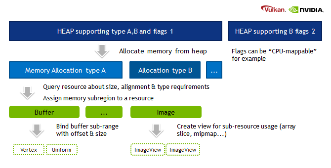
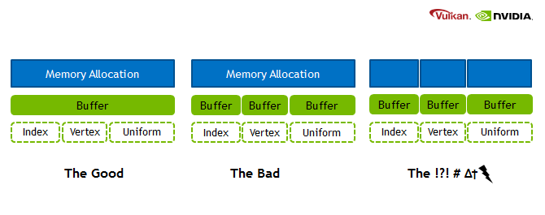

# 环境配置
1. vulkansdk,glm,glfw下载
2. VS2017项目配置
    1. include
    2. lib
    3. linkerinput
    4. C++语言标准 ISO17
# Triangle
- SDK可能需要重装?
    - 下载是一个艰难的过程
- 归纳一下ValidationLayer报错
    - validation layer: loader_get_json: Failed to open JSON file C:\Program Files\Rockstar Games\Social Club\SocialClubVulkanLayer.json
    - validation layer: SPIR-V module not valid: Codesize must be a multiple of 4 but is 439. The Vulkan spec states: If pCode is a pointer to SPIR-V code, codeSize must be a multiple of 4 (https://www.khronos.org/registry/vulkan/specs/1.1-extensions/html/vkspec.html#VUID-VkShaderModuleCreateInfo-pCode-01376)
    - validation layer: SPIR-V module not valid: Invalid SPIR-V magic number.
    - validation layer: VkShaderModule 0x0[] does not contain valid spirv for stage VK_SHADER_STAGE_VERTEX_BIT. The Vulkan spec states: module must be a valid VkShaderModule handle (https://www.khronos.org/registry/vulkan/specs/1.1-extensions/html/vkspec.html#VUID-VkPipelineShaderStageCreateInfo-module-parameter)
    - validation layer: No entrypoint found named `main` for stage VK_SHADER_STAGE_VERTEX_BIT.. The Vulkan spec states: pName must be the name of an OpEntryPoint in module with an execution model that matches stage (https://www.khronos.org/registry/vulkan/specs/1.1-extensions/html/vkspec.html#VUID-VkPipelineShaderStageCreateInfo-pName-00707)
- SPIR-V 
    - Standard, Portable Intermediate Representation - V 
    - SPIR-V是一种中间码代称,可以由任何Shader Language转换而来,便于Vendor进行优化
- **!GLSL需要编译成SPIR-V的,理同HLSLBlob!**
- Get
    - SPIR-V 450需要1.2+版本的Vulkan支持
# Vertex&Index Buffer
- VertexBuffer的使用
    - MemoryRequirements -> 获取VertexBuffer所需内存信息
    - Find MemoryAllocation 在 PhysicalDevice中
    - Allocate VkDeviceMemory
    - MemoryCpy
- TODO : Modification
    - Modify QueueFamilyIndices and findQueueFamilies to explicitly look for a queue family with the VK_QUEUE_TRANSFER_BIT bit, but not the VK_QUEUE_GRAPHICS_BIT.
    - Modify createLogicalDevice to request a handle to the transfer queue
    - Create a second command pool for command buffers that are submitted on the transfer queue family
    - Change the sharingMode of resources to be VK_SHARING_MODE_CONCURRENT and specify both the graphics and transfer queue families
    - Submit any transfer commands like vkCmdCopyBuffer (which we'll be using in this chapter) to the transfer queue instead of the graphics queue
- StagingBuffer
    - 相当于intermediate buffer,中间层
    - 存在的意义是需要FormatConversions
    - 也需要command去上传
# Uniform Buffer
- DescriptorSetLayout
    - VkDescriptorSetAllocateInfo将内容分配(写)在Layout中
    - Uniform签名式的Descriptor
    - UniformBuffer必须在DescriptorPool中使用
- UniformBuffer
    - 一种UniformBufferObject对应一个UniformBufferSize
    - 一个SwapChainFrame对应一个UniformBuffer
- DescriptorPool
    - DescriptorPool中存储多个DescriptorSet的信息
    - DescriptorSet的内容写入DescriptorBuffer
    - DescriptorBuffer用DescriptorWrite写入
# Vulkan内存分配
- https://developer.nvidia.com/vulkan-memory-management
- 来阅读一下NV的文档
- Importance of Allocation
    - OS State : Allocation包含系统核态用户态的转换
    - Allocation Reusage : AllocationMemory的重用通常快于再分配
    - Cache Accrancy : 连续内存中的对象拥有更高的Cache命中率
    - Aligement : 对硬件Alige更好的数据可以被更快地处理
- 3 parts of Vulkan memory
    - Device Memory: Buffer & Images : 用户定义行为
    - Resource Pools: CommandBuffers & DescriptorSets : 从Pool中分配而来, 驱动实现
    - Custom Allocators: 自实现驱动使用的Allocator
- 
- Vulkan Memory 
    - Heap : Depending on the hardware and platform, the device will expose a fixed number of heaps, from which you can allocate certain amount of memory in total. Discrete GPUs with dedicated memory will be different to mobile or integrated solutions that share memory with the CPU. Heaps support different memory types which must be queried from the device.
    - Memory type: When creating a resource such as a buffer, Vulkan will provide information about which memory types are compatible with the resource. Depending on additional usage flags, the developer must pick the right type, and based on the type, the appropriate heap.
    - Memory property flags: These flags encode caching behavior and whether we can map the memory to the host (CPU), or if the GPU has fast access to the memory.
    - Memory: This object represents an allocation from a certain heap with a user-defined size.
    - Resource (Buffer/Image): After querying for the memory requirements and picking a compatible allocation, the memory is associated with the resource at a certain offset. This offset must fulfill the provided alignment requirements. After this we can start using our resource for actual work.
    - Sub-Resource (Offsets/View): It is not required to use a resource only in its full extent, just like in OpenGL we can bind ranges (e.g. varying the starting offset of a vertex-buffer) or make use of views (e.g. individual slice and mipmap of a texture array).
- 
# TextureSample
- 硬盘 -> StagingBuffer
    - stb_image : 硬盘->内存
    - staging_buffer : Memory->StagingBuffer
    - 别忘了释放 stb_image产生的裸指针
- Create Image 
    - 在GPU Memory中创建Image View
    - StructureInfo
    - Allocate Memory
- TransitionImageLayout
    - Setup VkImageMemoryBarrier
    - vkCmdPipelineBarrier(CommandBuffer)
- StagingBuffer -> GPU Memory
    - VkBufferImageCopy
    - vkCmdCopyBufferToImage
- ImageView 
    - GPU对Image的View
    - 对SwapChain和Texture都需要
- Sampler 
    - 就是采样器,采样规则在其中制定
    - AddressMode 
    - Filtering
    - Anisotropy Rule -> PhysicalDeviceFeature.Anisotroy Requested
    - BorderColor
    - UnnormalizedCoordinates -> True如果采样点在`(0, Width),(0, Height)`
    - CompareEnable -> 通常用于shadow map的percentage-closer filtering
- Texture 
    - DescriptorLayout
    - DescriptorSet
    - DescriptorPool
    - InputAttributeDescription
# DepthBuffering
- 改变Vertex属性
    - 更新getAttributeDescriptions
    - 更新shader.vert
    - 更新vertices数据
- glm includes 
    - `#define GLM_FORCE_RADIANS` -> 使用角度制
    - `#define GLM_FORCE_DEPTH_ZERO_TO_ONE` -> Vulkan的深度在[0.0, 1.0]
- findSupportedFormat
    - 寻找显卡支持的DepthTexture格式
    - 包括 candidates, tilting, stencil_attachments, features_flag
- 更新函数, 显式处理aspectMask
    - 更新createImageView
    - 更新transitionImageLayout -> 包含aspectMask的设计和枚举Stage
- 更新 RenderPass
    - Add Depth's AttachmentDescription&AttachmentRefence
    - Update SubpassDescription&SubpassDependencyMask
- 更新 CreateFrameBuffers
    - 每一个 SwapChainImageFrameBuffer都需要一个DepthImage
- 更新 CreateCommandBuffer
    - 更新ClearValue
- 更新 CreateGraphicsPipeline
    - 添加 DepthStencilStageCreateInfo
- 更新 RecreateSwapChain
# Model Loading
- 有必要吗?
    - RTR尚未开始,而RTR开始的时候避免不了LoadingModel
    - 另一个问题是,Vertex这一部分,有必要重构
    - 问题的关键在于,不清楚RTR是否能够提供一个合理的Vertex重构方案, 
        - 如果不能,这里的工作是有必要的
        - 如果能,这里的工作是Duplicate的
    - 多做不亏
- 我很不愿意把事情留到明天,但是这边Clone成为了Blockage
- 复习了一下HDR, Blockage进行到LoadModel结束, 因为一些众所周知的原因,明天想办法Clone库
- 因为没睡好很头晕啊,今天下班早,还好.
- 但即使如此,我们还是要写笔记,并且完成ModelLoading啊
- 先解决了昨天的Blockage 
- vcpkg 有问题, 手动build吧
- yysy 一共只有一个.h文件, 还vcpkg, 有点搞笑
# Vertex deduplication
- 模型中过量的indices导致vertex duplication问题
- 使用unorderedmap避免vertex duplication
    - 还需要实现Vertex的
        - Copy Constructor
        - Trait Std::Hash<Self>